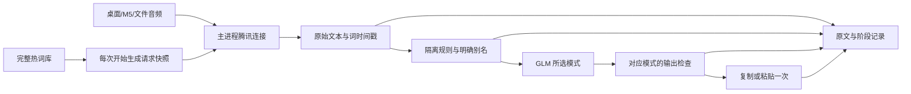

# 腾讯直连与语音文本整理审查

日期：2026-09-28。基线：`82cf094`。范围：桌面录音、M5 录音、客户端文件识别、热词库、文本整理与交付。改动保留在工作区，未提交、未替换运行中的客户端。

## 已修复的问题

| 优先级 | 证据与影响 | 实现 |
| --- | --- | --- |
| P1 | 旧热词库把腾讯单次 128 条限制用于永久存储，追加时删除旧词；默认权重 11，所有词都被强偏置 | 完整 JSON 词库与请求快照分开；新词默认 5；旧权重保留；请求最多 128 条，有省略和格式统计 |
| P1 | 正则直接在主进程执行；危险回溯能阻塞界面和取消操作 | 独立子进程、200 ms 截止、强制结束；失败保留输入 |
| P1 | 规则级联，匹配发生在改过的文本；路径、数字、技术标识符可被二次改坏 | 在原文收集匹配、最长非重叠优先、从后向前替换；保护代码、URL、路径、数字、标识符 |
| P1 | 「二、→二」「负一→-1」「紫禁城→子进程」存在错误语义替换 | 内置删除，旧用户规则文件在加载时过滤这三项，原文件不重写 |
| P1 | 通用优化入口与听写整理入口分散，模型、提示词、取消规则不一致 | 主进程统一 `SpeechTextFormatter`；固定免费模型与请求域名；`process-text` 和 `polish-text` 共用取消管理 |
| P1 | 终端/未知窗口阻止了整理本身；另一端多行自动粘贴可能触发执行 | 整理与交付分开；终端/未知目标的多行结果仅复制 |
| P1 | 记录历史/录音样本与异步整理竞态；M5 回执不论实际结果都报 pasted | 等待完成后保存原文、纠正、最终、交付文本；按实际结果回执；同一录音并发完成仅交付一次 |
| P1 | 腾讯依赖远端中转；本机直连需保持原实时 PCM 协议 | 主进程签名与云端 WebSocket；应用自身持有回环适配器，兼容现有桌面、M5、文件入口 |
| P1 | 本次打包发现已有 ffmpeg 二进制仅 3,921,752 字节，原文件截断且运行崩溃 | 构建产物替换为同版本完整二进制，构建钩子检查可执行性和版本；包内做实际 PCM→MP3 转码 |
| P2 | M5 主进程实时会话没有传热词；结果归一化丢失词库版本和词时间戳 | 各入口保留实际请求快照、版本、段和词时间戳；在开始录音时选词，不复用预热时的旧快照 |
| P2 | 自定义提示词字符串替换会解释 `$&` 等内容；模型响应体没有完整截止保护 | 回调方式代入原文；同一截止覆盖连接、响应头和响应体；截断结果不交付 |
| P2 | 极速文件接口的流式错误可能被 JSON 解析 catch 吞掉 | 明确区分事件解析与服务端失败，保留取消和转码异常路径 |

## 数据流



“本机直连”仍需联网访问腾讯，文本整理访问智谱。回环端口由客户端自身创建和销毁，无需 AGX/AI 服务器上另起 ASR 服务。云端密钥及腾讯签名 URL 留在主进程；渲染进程只得到随机能力地址。

### 两种模式

| 项目 | 轻度润色 | 提示词优化 |
| --- | --- | --- |
| 模型 | `glm-4.7-flash` | `glm-4.7-flash` |
| thinking | 显式 `disabled` | 显式 `disabled` |
| 提示词 | 专用保真整理指令 | 固定 WorkBuddy 5.5.6 两份原始模板 |
| 行为 | 标点、断句、自然分段、明确填充音与代词口吃 | 改写为约 800 字符内的提示词，可压缩长输入 |
| 截止 | 整理总预算约 2 秒；模型最多 1800 ms | 整理总预算 30 秒 |
| 检查 | 数字、路径、标识符、否定/条件词、操作符不变；限制词汇变化 | 独立检查完整性、格式、原始技术参数，不套用轻度模式逐词一致规则 |
| 失败 | 保留规则/明确别名处理后的文本，记录原因 | 同左 |

不重试到任何付费 GLM 型号。取消后丢弃迟到结果。禁用 CT-Punc；`longTextFormatter.js` 的旧模型类仅供历史对照脚本使用，运行入口不实例化该类。

校验器只是防止已知破坏，不能证明提示词优化永远忠实；正式使用仍需人工样本验收。预算只涵盖 ASR 返回后的文本整理，不包含录音、ASR 或系统粘贴耗时。

### 热词与分词

- `hot-words.txt` 作为兼容来源保留；完整词库写入 `hot-words.json`，使用原子替换。旧词不因 128 条限制被清除。
- 每词保存权重、启用状态、明确别名、排除上下文、更新时间。默认权重 5；保留旧设置，不批量降权。
- 请求快照按上下文匹配、最近三天编辑和权重排序，最多发送 128 条。上下文优先需要调用方显式提供上下文词；当前界面主要用编辑时间和权重。
- 不在中文里做 Soundex 式模糊替换。原始偏移与受保护区域贯穿分词/匹配，英文词边界防止短别名侵入完整单词。
- 剪贴板只产生候选，确认保存后才生效。页面可查看下一次请求的具体词表。
- 记录词库版本和规则版本；已保存的请求快照用于同一段录音的纠正。进程缓存最近 20 个版本，长时间录音期间大量编辑可能导致旧别名快照无法命中，此时跳过别名，不用新版本冒充旧版本。

### 腾讯协议、计量和凭据

- 普通版请求保留腾讯原生标点和 `word_info=2`；2.0 不传不受支持的参数，分别归一化两种响应。
- 16 kHz、单声道、16 bit PCM，每 200 ms 发送 6400 字节；队列积压、握手、尾句与空闲有明确截止。
- partial 替换同一片段，稳定片段不被迟到的临时结果覆盖；最终只交付一次。
- 额度选择与预留在同一个同步步骤；账本原子写入；月度、过期资源、浮点余额和异常退出均处理。
- 按此前确认的策略，普通版免费额度未知/不足时选择 `16k_zh_en_2.0`，4004 仅在发送音频前允许一次切换。文件使用极速版。**2.0 和极速版可能收费；本轮没有对真实腾讯账号调用这些接口，全部为模拟测试。** GLM 免费限制与腾讯费用是两项独立配置；启用前应确认账号套餐。
- 本地预留和云端余额有延迟；120 秒预留不能保证一次长录音或其他客户端消费后仍完全免费。此实现不是腾讯账户的硬费用上限。
- `provider-secrets.json` 使用 Electron 系统密钥环加密，只向设置页返回“是否配置”；不写入通用设置数据库。可读取已有进程环境配置。
- 本轮提供的 GLM Key 只在实测进程内存中使用，进程已结束。当前测试环境系统密钥环不可用，因此未持久化密钥；未降级明文。腾讯已有凭据文件只核实存在，未复制或输出内容。

## 对近一年活跃输入法项目的参考

以下项目由研究子代理审查，记录固定提交，使用工程思路；未复制 GPL 项目的代码。星标是当时观察值，不作为质量或速度证据。

| 项目（2026-09-24 观察） | 固定提交 | 本次借鉴 |
| --- | --- | --- |
| [Handy](https://github.com/cjpais/Handy/tree/8f9cf53cd1410cda26beea39ff802ac306e39585)（约 3.2 万星） | `8f9cf53` | 优先把词库送入识别器；中文避免英语语音散列；约束后处理范围 |
| [OpenWhispr](https://github.com/OpenWhispr/openwhispr/tree/6ecfea8c36ea6e085c2b4984473f3d3a26349922)（约 8500 星） | `6ecfea8` | 完整词库与实际发送预算分开；用户确认候选词；显式关闭推理模式 |
| [CapsWriter-Offline](https://github.com/HaujetZhao/CapsWriter-Offline/tree/84912d5218ee5e51e216c54dc15a1cb0f466eb76)（约 6800 星） | `84912d5` | 明确纠音词、排除上下文、原始字符偏移、重叠优先级和从后向前替换 |
| [VoiceInk](https://github.com/Beingpax/VoiceInk/tree/d7b528aaf184db2ee946dffe920e557a1a34617d)（约 6500 星） | `d7b528a` | 识别、基础整理、增强、交付、历史保存分阶段，避免混淆原文和最终文本 |

提示词模式直接使用用户指定的 [WorkBuddy 5.5.6 模板](../assets/prompts/workbuddy-5.5.6/README.md)，两份 SHA-256 随包验证。

协议依据：[腾讯普通实时 ASR](https://cloud.tencent.com/document/api/1093/48982)、[腾讯 2.0 实时协议](https://cloud.tencent.com/document/product/1093/131127)、[腾讯计费说明](https://cloud.tencent.com/document/product/1093/35686)。`DescribePidOrders` 的余额字段映射还依赖现有项目实测结构，尚未使用用户账户重新验证。

模型依据：[GLM-4.7-Flash 免费模型](https://docs.bigmodel.cn/cn/guide/models/free/glm-4.7-flash)、[thinking 参数](https://docs.bigmodel.cn/cn/guide/capabilities/thinking.md)。关闭 thinking 是输入法延迟与确定性选择，本轮没有做 thinking 开关的质量 A/B 对照。

## 已完成验证

1. `node --test test/*.test.js`：365 项通过。包括普通/V2 响应、签名、额度/并发预留、真实本地 WebSocket 与模拟腾讯、真实本地 HTTP/ffmpeg 与模拟极速识别、模型请求字段、保真、超时、取消、词库回滚、交付去重。
2. `npm run lint`：0 错误、7 项既有警告。`npm run build:renderer` 成功。
3. 独立 Electron 窗口验证模式切换、逗号别名编辑、剪贴板候选不立即生效、预览，页面 console error 为 0。测试隔离用户目录，不启动已安装客户端。截图与结果见 `artifacts/asr-review/`。
4. 3996 条历史文本离线对照：原有保护片段被破坏的记录数，旧规则 5、新规则 0。规则输出差异 6 条。新的保护片段序列变化 13 条，主要来自显式规则生成新标识符，原始受保护片段保持。**这些不是人工真值，不能报告 CER/WER 或识别准确率提升。**
5. 真实免费 GLM 小样本：提示词优化一次 921 ms 成功；轻度模式多次 1800 ms 超时或 HTTP 429，均保留基础文本；最小诊断也出现 30 秒超时。没有付费回退。原始统计见 `artifacts/asr-review/glm-live-check.json`，不含密钥或私人语料。
6. 打包验证：Electron 36.5.0/x64、实际 PCM→MP3 转码、默认 200 ms 内的正常规则、危险规则强制超时、两份模板 SHA-256、原生 SQLite/uiohook 均通过；132 个随包文件与源码逐字节一致。结果见 `artifacts/asr-review/package-check.json`。脚本使用包内 Electron 的 Node 模式，不启动应用主入口。

### 构建记录

已存在的 `ffmpeg-static@5.2.0` 二进制损坏。构建时使用它指定的 [b6.0 官方发布附件](https://github.com/eugeneware/ffmpeg-static/releases/tag/b6.0)，完整大小 78,683,840 字节，SHA-256：

```text
ed652b2f32e0851d1946894fb8333f5b677c1b2ce6b9d187910a67f8b99da028
```

仅替换新输出包中的二进制，附带上游 README/LICENSE；源 `node_modules` 和安装中的客户端不变。重新构建需要完整的同版本 ffmpeg，或指定已验证文件：

```bash
npm run build:renderer
CAPS_BUILD_FFMPEG="/path/to/verified/ffmpeg" npm exec -- electron-builder --linux AppImage --publish never --config.npmRebuild=false --config.directories.output="dist/asr-review"
xvfb-run -a env ELECTRON_RUN_AS_NODE=1 "dist/asr-review/linux-unpacked/speech-transcription" "scripts/verify-speech-package.cjs" "dist/asr-review/linux-unpacked/resources/app.asar"
```

当前只构建和验证 Linux x86_64；没有声称 Windows/macOS 已通过运行验收。

候选产物：`dist/asr-review/CapsWriter-GUI-1.0.31-linux-x86_64.AppImage`，159,287,759 字节，SHA-256：`9ebf2e23b0a8d9ef0004304dd5184705c0c2218c0ecd92ae88e8b67347a6d255`。版本号沿用工作区的 1.0.31，不能仅凭版本号区分候选包与旧安装，请核对摘要。

## 尚未完成的运行验收

- 安装候选包、重启当前客户端、迁移腾讯凭据及在实际桌面密钥环持久化 GLM Key。这些会改变持久配置/中断录音，按用户 AGENTS.md 要求在安装前确认。
- 实际桌面录音、M5 设备录音、文件样本经过真实腾讯接口的端到端验证；本轮没有用模拟测试冒充这项验收。
- 120 条人工标注的开发/留出音频集，分别统计断句、术语命中、误替换、关键约束、交付结果与 p50/p95 耗时。现有历史 ASR 输出不能当正确答案。
- 免费 GLM 的服务可用率和延迟暂不满足“稳定 2 秒内成功”的结论；当前完成的是硬截止和可恢复交付，须在用户实际网络和账户配额下持续观察。

## 设计取舍

主进程把签名、凭据、词库、整理与适配各自封装（单一职责）；旧入口共用同一整理服务和结果元信息（DRY）。使用现有 PCM/multipart 协议和简单 JSON 原子账本，避免新增服务器或数据库迁移（KISS）。没有引入中文模糊纠音模型、额外付费模型或未经评估的全局替换（YAGNI）。

## NX6 部署补充（2026-09-28 12:32，覆盖上文部署待办）

- 用户已授权部署；腾讯及免费 GLM 凭据已存入 NX6 加密存储。腾讯直连已由用户实际录音确认可用。
- 当前目标为 NX6 ARM64；Ivan 客户端已停用并恢复旧启动入口。FireRed2 模型与客户端均运行于 NX6。
- 新增 `services/firered-local/` 精简服务，只使用现有 AED/VAD/Punc 模型。监听 `127.0.0.1:18011`，不依赖旧后台或其他机器。用户服务 `capswriter-firered-local.service` 当前运行，本次未启用开机自启。
- GUI 的 ASR 服务端新增预置“FireRed2 · 本机”，自动合并到已有配置，保留当前选择和自定义连接。显示模型就绪状态，沿用统一客户端整理。GUI 连接测试改为 ready 后 cancel，不发送音频。
- 分帧边界检查 4 项通过；配置迁移、双向选择及无音频探测等 7 项通过；修改涉及的前端文件 ESLint 通过，renderer 构建通过。
- NX6 实际 Electron `file://` 页面连接本机服务成功，返回 `provider=firered2`，发送音频 0 字节。尚未进行用户实际 FireRed2 录音验收，文件转写也尚未用真实样本验收。
- ARM64 包验证通过（原生模块、ffmpeg、模板与规则子进程），141 个随包源码匹配。已替换 NX6 AppImage 并重启客户端，两项服务 active，重启次数均为 0。
- 当前 AppImage SHA-256：`34146d7a8fed7d5b9fbd6326fa1608f87db7f8bb614495907677666025a608a7`。上一版备份：`/home/nx/.local/share/capswriter-backups/20260928-123141-firered-gui/`。

## 提交后 Review（基线 54b4bfa）

检查客户端整理、供应商适配、配置切换、取消、交付与本机服务的资源释放路径，发现并修复：

1. **P1：未知窗口被当成已知编辑器。** `resolveTerminalState` 原先直接返回终端判断的 false，未命中的窗口会自动接收多行粘贴。改为已知编辑器名单；其余返回 unknown 并仅复制。新增未知窗口回归断言。
2. **P1：直接插入入口绕过多行保护。** `insert-text-directly` 直接调用 clipboard，未共用 `paste-text` 的保护。两入口现共用一项判断，新增直接插入回归断言。
3. **P2：FireRed2 非对象控制消息异常退出。** JSON 的 null、数组、数字或字符串能通过解析，但 `.get()` 会抛未处理的 AttributeError。现明确返回协议错误并关闭连接；无模型测试覆盖上述四类输入，以及忙碌拒绝不能释放另一会话锁。

修复后 JavaScript 367 项全部通过，FireRed2 控制协议 2 项通过。原始模板中的两处行末空格保留，因为它们属于逐字节固定、经过哈希校验的参考模板。

### 窗口消失排查

NX6 客户端 PID 2373940 自 12:31:42 升级重启后持续存活，NRestarts=0；FireRed2 亦持续运行。对应时间段未找到 OOM、segfault 或新崩溃转储。通过应用自己的 D-Bus 托盘“设置”菜单恢复正常界面，并在 NX6 实际桌面打开 ASR 服务端页，确认腾讯和 FireRed2 选项存在。

升级重启关闭了旧窗口，而启动代码默认隐藏窗口；该行为与此次“退出”观感相符，但不能据此排除更早、未报告具体时刻的其他异常。没有将单纯进程存活当作 GUI 验证，也没有停止占用 GPU 的其他应用。

## 第二轮 Review（基线 060357b）

- **P1：腾讯 WebSocket 输入的结构异常未隔离。** 上游 `null`、非对象或错误分句数组，以及本地控制消息 `null`，会在事件回调中触发 TypeError，存在影响 Electron 主进程的风险。现在校验消息类型、隔离分句解析异常，只结束当前会话；新增无云端、无音频的异常消息回归测试。此为代码审查发现，不认定为此前窗口消失的实际原因。
- **P2：旧词表合并覆盖 GUI 权重。** 旧文本文件一旦追加任意行，会重导入所有词条权重，覆盖 JSON 词库中的人工调整。现在 GUI 编辑过的词条以 JSON 为准；未在 GUI 编辑的词仍接受旧文件权重变更，新词继续合并。回归测试覆盖重启重载后的权重、别名和禁用状态。
- GitHub 推送在当前环境被认证阻挡：HTTPS 没有可用凭据，现有 gh 令牌失效，SSH 公钥未获授权。没有修改远端、清除凭据或强制推送。

## FireRed2 懒加载与闲置卸载

- 后续用户完成 GitHub 设备授权，前三个提交已推送至 main（736f1d4）。
- FireRed2 启动时仅提供轻量接口；状态查询和 WebSocket 预连接不加载模型。开始识别或主动连接测试才加载，加载过程发送 loading 事件，客户端本机配置允许 120 秒准备时间。
- 录音/文件识别结束或取消后计时，连续 600 秒无活动任务则卸载 AED/VAD/Punc，执行垃圾回收并清理 CUDA 缓存；每 5 秒检查一次。活动任务不会被卸载，加载/卸载互斥。
- 冷启动中的取消仍能及时接收；模型加载完成后不向已取消会话发送 ready，不执行识别，并释放会话占用。
- Python 生命周期、协议及分句检查共 10 项通过；JavaScript 371 项通过；ARM64 包验证通过，151 个源码匹配。
- NX6 实际待机状态 idle，idle_unload_seconds=600，服务首次启动 RSS 约 23 MB，预连接及状态查询后仍未加载模型。此时另一个 llama-server 占用约 13 GB 内存，故未强行执行真实模型冷加载或宣称已验证真实 GPU 内存卸载。
- 本次也同步前一轮已推送的腾讯异常消息隔离和热词权重修复到 NX6。

## FireRed2 自动使用 NX6 本地整理模型

- FireRed2 配置及携带 `provider=firered2` 的识别结果使用本机 Qwen3-4B-Instruct-2507 Q4_K_M；其他连接继续使用免费 GLM-4.7-Flash。录音和文件入口传递识别供应商，避免中途切换配置导致本地文本发往云端。
- 共用原有规则、热词、提示词、结果校验和取消路径。本机请求不读取云端密钥，禁止 HTTP 重定向；失败保留上一阶段文本，无云端重试。轻量整理预算 15 秒，提示词优化 60 秒。
- NX6 独立服务 `capswriter-local-llm.service` 监听 `127.0.0.1:18087`，使用既有 ARM64 llama.cpp 镜像；模型已校验 SHA-256。关闭思考，8192 token 上下文，连续闲置 600 秒由 llama.cpp 休眠卸载，下一次请求唤醒。首次服务启动会加载模型；本次未启用登录自启。
- 真实本机文本请求：轻量模式 1035 ms、提示词模式 3917 ms，均 `provider=local`、`degraded=null`。轻量样例原文未变，此项只证明调用链，不证明标点效果最优。
- FireRed2 无音频 start/ready/cancel 检查通过，冷加载 13.32 秒；两模型同时加载后系统可用内存约 4 GB，本机 LLM 健康正常。此前占用约 13 GB 的外部模型已被其他操作停止，本次没有修改该服务。
- JavaScript 373 项通过；新增自动路由、切换中供应商保护、禁止云端凭据读取及故障回退检查。ARM64 包验证通过，161 个源码匹配；已在 NX6 实际桌面确认新设置文字。
- 尚未进行真实语音准确率验收、物理断网全流程验收或实际等待 10 分钟后的 LLM 唤醒验收；由用户实录继续验证。超出本地上下文容量的请求会保留基础结果。

## 本地日常输入取消大模型等待（覆盖上一节自动整理行为）

- 用户实测认为 Qwen3-4B 太慢，确认改为 FireRed2 标点加客户端热词、规则和列表分段。主进程对本地自动请求强制走轻量规则路径，即使已保存的处理模式为 prompt，也不会调用本地或云端大模型。
- 设置新增“手动提示词优化”按钮，粘贴文字后显式点击才调用本机 Qwen；日常预览与自动输入一致。腾讯自动整理保持原流程。复用同一整理入口，只增加明确的手动标记，避免另建流水线。
- 回归检查 29 项通过，覆盖本地轻度/提示词自动模式零模型调用、热词别名仍生效、手动本地调用、切换中 FireRed2 结果保护、腾讯自动调用。涉及文件 ESLint 和 renderer 构建通过。
- NX6 实际文本路径检查：已选本地、请求 prompt、模型调用次数 0、返回 light，规则处理样例耗时 68 ms。此数值不包含录音、ASR 和标点耗时，不代表完整输入延迟。
- ARM64 安装包验证通过，181 个源码匹配；保留原版备份后更新 NX6 客户端，实际语音体验继续由用户验收。
